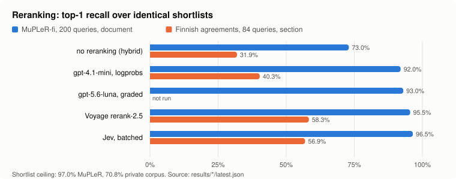
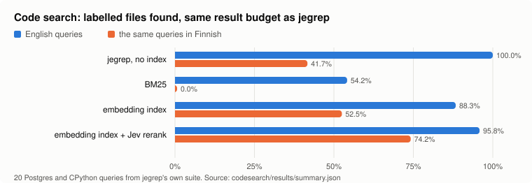
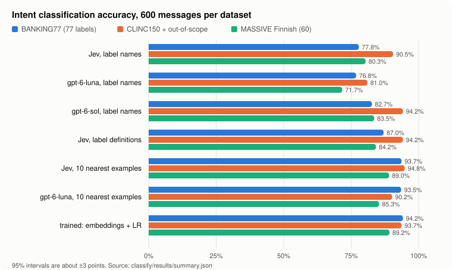

# jev-rerank-bench

Where does a **typed-judgment model** earn its place: in search, or only in
classification? Three benchmarks of [TypeSafe Jev](https://docs.typesafe.ai), which
returns a probability instead of generated text, against the tools it would replace.

| | Question | Compared against | Data |
| --- | --- | --- | --- |
| [Reranking](#1-reranking) | Does Jev rerank a search shortlist better than a cross-encoder? | Voyage `rerank-2.5`, gpt-4.1-mini, gpt-5.6-luna, Laya open weights | MuPLeR-fi (public) and 160 Finnish collective agreements (private) |
| [Code search](#2-code-search-without-an-index) | Can Jev search a code base with no index at all, as [jegrep](https://github.com/can1357/jegrep) does? | BM25, an embedding index, the index plus a Jev rerank | jegrep's own labelled Postgres and CPython queries, in English and Finnish |
| [Classification](#3-classification) | Is Jev the best intent classifier? | gpt-6-sol, gpt-6-luna, gpt-5.6 models, gpt-4.1-mini, trained classifiers | BANKING77, CLINC150, MASSIVE Finnish |

## The short answer

**Search, yes: as the judge over a shortlist.** Over identical shortlists Jev
reranked as well as a dedicated cross-encoder on both legal corpora. It beat both
chat models, and its probability works as a gate: on MuPLeR it answered 55% of queries with no
top-1 errors. On code search it lifted an embedding index from 80% to 94% of the
labelled files in the top five, and from 66% to 90% when the questions were in Finnish.

**Not as a first stage over a large corpus.** Cost grows with what it reads. jegrep
works without an index on a code base, finding every labelled file for English
questions, but its candidates come from a keyword scan: the same questions in
Finnish found 42%, and five returned nothing.

**Classification, yes, but not because it is the most accurate.** With label names
alone, gpt-6-sol and gpt-5.6-sol beat it by 2–9 points. One-sentence label
definitions closed most of the gap. With ten labelled examples in state it tied a
logistic regression trained on the full training set, and nothing beat that
classifier. What Jev adds is a sub-second answer, a few cents per thousand, and a
probability that gates. gpt-6-luna, the cheapest new chat model, was less accurate
than Jev zero-shot: 9 points on CLINC and Finnish, a tie on BANKING77.

## 1. Reranking



The picture above the title is the problem. A corpus of Finnish collective
agreements contains hundreds of documents that repeat each other section for
section, so the same numbered provision exists, nearly word for word, in dozens of
them. The passage text does not identify the right answer; the document it belongs
to does. A bi-encoder never sees the query and the passage together, so it cannot
make that distinction. A reranker can.

Every reranker receives the **identical shortlist** (hybrid Postgres FTS + pgvector,
30 candidates), and every model is asked the **identical question**: the LLM
baselines import the wording from `src/rerank/questions.ts`, and the Laya baseline
reads it through `bun run dump-question`.

**MuPLeR-fi, 200 queries, document level.** [Full tables](docs/findings-mupler.md).

| strategy | R@1 | MRR@10 | rerank p50 | \$/1000 queries |
| --- | --- | --- | --- | --- |
| `hybrid` (no reranking) | 73.0% | 0.797 | — | — |
| `hybrid+llm-4.1-mini` | 92.0% | 0.943 | 1798 ms | \$5.09 |
| `hybrid+llm-5.6-luna` | 93.0% | 0.949 | 3259 ms | \$2.76 |
| `hybrid+voyage` | 95.5% | 0.962 | 332 ms | **\$0.51** |
| **`hybrid+jev-batched`** | **96.5%** | **0.968** | **331 ms** | \$0.60 |

The shortlist ceiling is 97.0%: batched Jev put the gold passage first on 193 of
the 194 queries where the first stage retrieved it.

**Finnish collective agreements, 84 queries, section level.** Not redistributable:
only aggregate numbers are published. [Full tables](docs/findings-fi-tes.md).

| strategy | R@1 | MRR@10 | \$/1000 queries |
| --- | --- | --- | --- |
| `hybrid` (no reranking) | 31.9% | 0.411 | — |
| `hybrid+laya-noul` (open weights) | 8.3% | 0.148 | \$0 |
| `hybrid+llm-4.1-mini` | 40.3% | 0.486 | \$7.30 |
| `hybrid+jev-batched` | 56.9% | 0.601 | \$0.90 |
| **`hybrid+voyage`** | **58.3%** | **0.619** | \$0.74 |

On the harder corpus, with human-written questions and near-duplicate documents,
the cross-encoder is ahead by 1.4 points, one query. Neither corpus has a
clear winner between the two.

### The largest effect is the question, not the model

The relevance judgment written for the collective agreements demands provenance:
the passage must come from the document the question names. MuPLeR passages carry
a bare numeric id, so that condition can never be verified, and a Noul that cannot
verify its condition answers no.

| relevance judgment | MuPLeR `jev-noul` | MuPLeR `jev-batched` | agreements `jev-batched` |
| --- | --- | --- | --- |
| written for the agreements | 66.5% | 77.0% | **56.9%** |
| written for passage relevance | **95.5%** | **96.5%** | 51.4% |

MuPLeR without reranking scores 73.0%, so the mis-specified question made
reranking *harmful*. Changing one criterion and dropping two state fields moved
the score by thirty points, more than every model difference here combined.

### It knows when it is right

MuPLeR, gated on the top-1 score:

| threshold | `jev-batched` answered / correct | `voyage` | `llm-4.1-mini` |
| --- | --- | --- | --- |
| 0.5 | 95% / 99% | 98% / 97% | 90% / 94% |
| 0.8 | 77% / 99% | 56% / 99% | 88% / 95% |
| 0.9 | **55% / 100%** | 11% / 100% | 85% / 95% |

`gpt-4.1-mini`'s logprobs saturate near 0 and 1, and GPT-5.x rejected `logprobs`
at the time of the run, so the chat models offer no usable gate.

### Batching is free quality

| MuPLeR | requests | rerank p50 | \$/1000 | R@1 |
| --- | --- | --- | --- | --- |
| `jev-noul`, one call per candidate | 6000 | 892 ms | \$0.93 | 95.5% |
| `jev-batched`, 15 candidates per call | 400 | **331 ms** | **\$0.60** | **96.5%** |

Independent questions over shared state are judged separately inside one request,
so the framing is billed once instead of fifteen times.

### Three things that did not work

- **Fusing rankers.** `bun run fuse` searches 245 combinations offline, selecting
  on half of the queries and reporting the other half. On MuPLeR the best fusion
  ties the best single ranker (94.0% on held-out queries). On the agreements,
  `jev-batched` and `voyage` shared 27 of 31 failures; the per-candidate scores of
  that run were not kept, so this figure cannot be recomputed from `results/`.
- **A deeper shortlist.** 100 candidates instead of 30 raise the ceiling from
  70.8% to 84.7% but R@1 by only 1.4 to 2.8 points, at 3.3x the cost.
- **Open weights.** Laya, asked the identical question, scores 8.3% R@1, below
  no reranking at all.

## 2. Code search without an index



[jegrep](https://github.com/can1357/jegrep) v0.1.2 (release binary, checksum
verified) against an index built over the same code, on jegrep's own 20 labelled
Postgres and CPython queries. Each query was also asked in Finnish. A ranker is
scored on as many files as jegrep returned for the same query.
[Method, per-query results and limits](codesearch/README.md).

| | English | Finnish | \$/query | s/query |
| --- | --- | --- | --- | --- |
| jegrep, no index | **100%** | 42% | \$0.0049 | 4.0 |
| BM25 | 54% | 0% | ≈0 | <0.1 |
| embedding index (`text-embedding-3-large`) | 88% | 52% | ≈0 | <0.1 |
| index + Jev rerank of the top 30 windows | 96% | **74%** | \$0.0012 | 0.4 |

- These suites are where jegrep was developed, so its English result is in-sample.
  It also returns a lot: 4,567 lines per query on average, including whole files.
- In Finnish its keyword-based candidate step finds nothing to match, and Jev never
  sees the right files. Translate the query first, or keep an index.
- The index cost \$4.81 to build for the two repositories. At these prices jegrep's
  per-query cost pays for it after about 1,300 queries.

## 3. Classification



Seventeen classifiers answer the same 600 messages per dataset with the same
question and label list. [Full tables, costs and paired tests](classify/results/report.md),
[method and limits](classify/README.md).

| | BANKING77 | CLINC150 | MASSIVE fi | p50 latency | \$/1000 |
| --- | --- | --- | --- | --- | --- |
| Jev, label names | 77.8% | 90.5% | 80.3% | 0.24 s | 0.03–0.06 |
| gpt-6-luna, label names | 76.8% | 81.0% | 71.7% | 1.6 s | 0.04–0.09 |
| gpt-6-sol, label names | 82.7% | 94.2% | 83.5% | 1.7 s | 0.91–1.57 |
| gpt-5.6-sol, label names | 86.3% | 94.5% | 82.5% | 1.8 s | 0.96–1.61 |
| Jev, label definitions | 87.0% | 94.2% | 84.2% | 0.25 s | 0.10–0.19 |
| Jev, 10 nearest labelled examples | 93.7% | 94.8% | 89.0% | 0.24 s | 0.03 |
| gpt-6-luna, 10 nearest labelled examples | 93.5% | 90.2% | 85.3% | 1.5 s | 0.06–0.11 |
| trained: embeddings + logistic regression | 94.2% | 93.7% | 89.2% | ms | 0.002 |

95% intervals are about ±3 points. Chat-model latency includes a new connection per
call in this harness, an estimated 0.05–0.15 s of it.

- **Most zero-shot errors were label names that do not separate neighbours**
  (`order_physical_card` → `get_physical_card`, 11 times). Definitions cut
  BANKING77 errors from 133 to 78.
- **Out-of-scope without examples:** Jev caught 88% of CLINC's out-of-scope
  requests at 90% precision, the trained classifier 72%. Only the sol models did
  better (93–94%).
- **Gating:** with examples in state, Jev answered 97% / 100% / 88% of messages
  automatically at 95% accuracy, on par with the trained classifier. gpt-6-luna
  returns only the chosen token's logprob: 93% / 90% / 81%.

## Data and where it came from

| Data | Source | Licence | In this repository |
| --- | --- | --- | --- |
| MuPLeR-fi | [mteb/MuPLeR-retrieval](https://huggingface.co/datasets/mteb/MuPLeR-retrieval), `fi` split | EUPL-1.2 | results only; download to reproduce |
| Finnish collective agreements | a private collection of 160 agreements and statutes | not redistributable | aggregate metrics only, no text, questions or file names |
| Code-search queries | [jegrep](https://github.com/can1357/jegrep) `benches/`, commit `e6d5b84` | MIT | `codesearch/suites/` with its licence |
| Postgres, CPython | pinned revisions in each suite's `tag.json` | their own | not vendored |
| BANKING77 | [mteb/banking77](https://huggingface.co/datasets/mteb/banking77) | CC-BY-4.0 | per-message predictions only |
| CLINC150 plus | [clinc/clinc_oos](https://huggingface.co/datasets/clinc/clinc_oos) | CC-BY-3.0 | per-message predictions only |
| MASSIVE fi | [mteb/amazon_massive_intent](https://huggingface.co/datasets/mteb/amazon_massive_intent) | Apache-2.0 | per-message predictions only |

Models were called on 2026-09-20 (reranking) and 2026-09-24 (code search,
classification). Jev answered as `jev-1.13.0` throughout. Prices are the providers'
list prices on those dates.

## Running it

The reranking benchmark is the TypeScript project at the root:

```bash
bun install
cp .env.example .env          # TypeSafe, Azure OpenAI, Postgres; Voyage optional
bun run probe                 # checks every service before spending anything
bun run prepare-mupler        # parquet -> data/mupler/corpus.json
bun run ingest --dataset=mupler
bun run bench  --dataset=mupler
bun run report --dataset=mupler
```

```bash
curl -L -o data/mupler/fi-corpus.parquet \
  https://huggingface.co/datasets/mteb/MuPLeR-retrieval/resolve/main/fi-corpus/test-00000-of-00001.parquet
# likewise fi-queries and fi-qrels
```

`bun run fuse` searches ranker combinations offline, `bun run examples <strategy>`
prints the queries a reranker rescued and broke, and `bun run bench --limit=5` is a
smoke test. Any Postgres with pgvector works; `docker-compose.yml` starts one. The
committed runs used Neon in `eu-central-1`, so retrieval latency includes a round
trip from Finland. At this corpus size the planner declines the HNSW index
(`bun run check-index`), so the first stage is exact nearest-neighbour.

`codesearch/` and `classify/` are Python projects run with `uv`; each README lists
its commands. `python docs/charts.py` redraws the charts from the result files.

**Cost.** About \$16 for the reranking study, \$7 for code search (\$4.81 of it the
index) and \$8 for classification, of which Jev was \$0.50.

## What is left

- **A real BM25 first stage for reranking.** `ts_rank_cd` is not BM25, and on the
  agreements the weak lexical arm drags hybrid retrieval below vector alone.
- **Document-level routing** for "right section, wrong agreement": choose the
  agreement first, then search inside it.
- **A held-out code-search suite.** jegrep's Kubernetes queries were not run here.
- **Run-to-run variance.** Every number is a single run; two identical `jev-batched`
  runs differed by one query. Read sub-two-point gaps as noise.

## Licence

MIT. Datasets are downloaded, not vendored, except the jegrep queries under their
MIT licence.
